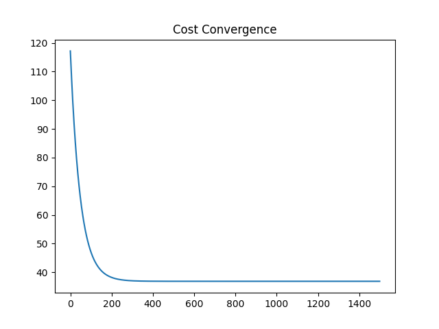
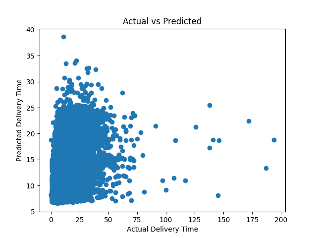

 Logistics Delivery Time Prediction System

 <b>Multivariate Linear Regression model predicting e-commerce delivery time using real-world logistics data.</b>  Built from scratch using Gradient Descent and compared with Scikit-Learn implementation. 

 Project Overview
This project builds a machine learning regression system to predict the number of days required to deliver an e-commerce order.

It follows a complete end-to-end ML pipeline:

Data merging from multiple sources

Feature engineering

Linear Regression (from scratch)

Scikit-Learn comparison

Model evaluation

Visualization

Model persistence

This project demonstrates applied machine learning on noisy real-world logistics data.

 Problem Statement
Predict:

Delivery Time (in days)
Where:

Delivery Time = Delivered Date − Purchase Date
This helps logistics teams:

Improve estimated delivery time accuracy

Optimize operational efficiency

Enhance customer satisfaction

 Dataset
Dataset used:
Brazilian E-Commerce Public Dataset by Olist
Source: Kaggle

Files used in this project:

olist_orders_dataset.csv

olist_order_items_dataset.csv

olist_customers_dataset.csv

⚠ Dataset is not uploaded due to size constraints.

Download from Kaggle and place inside:

data/raw/
 Project Structure
logistics-delivery-prediction/
│
├── data/
│   └── raw/
│
├── src/
│   ├── data_preprocessing.py
│   ├── feature_engineering.py
│   ├── model.py
│   ├── train.py
│   └── evaluate.py
│
├── models/
├── reports/
│
├── main.py
├── requirements.txt
└── README.md
The project follows modular architecture for clean separation of responsibilities.

 Feature Engineering
Features used:

Product price

Freight value

Customer state (one-hot encoded)

Purchase month

Target variable engineered:

delivery_time_days
Processing steps:

Merged multiple datasets

Removed missing delivery records

Converted timestamps to datetime

Created delivery time feature

Applied one-hot encoding

Performed feature scaling

 Model Implementation
1️ Linear Regression (From Scratch)
Implemented using:

Hypothesis function

Mean Squared Error cost function

Gradient Descent optimization

Mathematical formulation:

h
(
x
)
=
X
W
+
b
h(x)=XW+b
Cost function:

J
=
1
2
m
∑
(
y
p
r
e
d
−
y
)
2
J= 
2m
1
​
 ∑(y 
pred
​
 −y) 
2
 
2️ Scikit-Learn Linear Regression
Used for:

Model comparison

Faster training

Model persistence

Saved model file:

models/linear_regression_model.pkl
Model Performance
Results on test dataset:

MSE: 69.71
MAE: 5.49
R2 Score: 0.19
 Interpretation
Average prediction error ≈ 5.5 days

R² reflects real-world noisy logistics data

Model captures part of the delivery time variability

This demonstrates realistic behavior of linear regression on complex operational data.

 Visualizations
🔹 Cost Convergence (Gradient Descent)

  

This plot shows how the cost decreases over iterations, confirming proper optimization.

🔹 Actual vs Predicted Delivery Time

  

This scatter plot compares actual delivery days vs predicted values.

 How To Run The Project
1️ Clone repository
git clone <your_repo_link>
cd logistics-delivery-prediction
2️ Install dependencies
pip install -r requirements.txt
3️ Download dataset from Kaggle
Place required CSV files inside:

data/raw/
4️ Run the project
python main.py
Outputs:

Evaluation metrics printed in terminal

Trained model saved in models/

Plots saved in reports/

 Business Impact
This system can help:

Estimate delivery timelines

Identify delay-prone regions

Improve logistics forecasting

Support operational planning

🔮 Future Improvements
Include estimated delivery date feature

Add payment method features

Include product category information

Try Ridge / Lasso regression

Deploy as a web application

 Key Skills Demonstrated
End-to-end ML pipeline design

Multivariate regression

Gradient Descent implementation

Real-world feature engineering

Model evaluation & visualization

Modular ML architecture